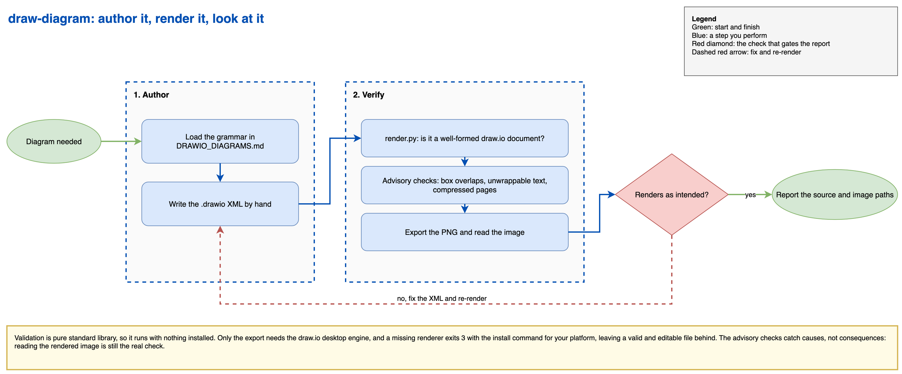

# draw.io diagram skill for Claude Code

A Claude Code skill that produces diagrams as draw.io files, then validates and renders them so the result is actually looked at before it is called done.

The problem it solves is narrow and specific. Asking a coding agent for a diagram usually gets you Mermaid or ASCII art, or a `.drawio` file that was never opened. XML validity says nothing about whether two boxes are printed on top of each other. This skill pairs a written visual grammar with a renderer, so the diagram gets produced, exported to an image, and inspected as part of the loop.

## How it runs



Source: [docs/drawio-skill-flow.drawio](docs/drawio-skill-flow.drawio) (editable in draw.io).

## What is in here

- **`draw-diagram/SKILL.md`** the skill itself. Loads the grammar, writes the XML, renders, looks at the image, reports where the source and the image were saved.
- **`draw-diagram/DRAWIO_DIAGRAMS.md`** the visual grammar: shape vocabulary, a seven-color palette, the layout skeleton (header strip, stage containers, data store column, footer), arrow conventions, and the decision-hub temporal-ordering defenses. It also carries the traps that only surface at render time, including the CLI exporter silently refusing `;base64` data URIs and text cells that do not wrap.
- **`draw-diagram/render.py`** validates a `.drawio` file and exports it to PNG, SVG, or PDF. Pure standard library for the validation half, so it runs anywhere with no install.

## Install

Copy the skill directory into your `~/.claude/skills/` so Claude Code picks it up:

```bash
cp -R drawio-diagram-skill/draw-diagram ~/.claude/skills/
```

The grammar file lives inside the skill directory, so the skill stays self-contained and there is nothing else to wire up.

To make draw.io your default for every diagram rather than something you ask for by name, copy the rule file into your rules folder:

```bash
mkdir -p ~/.claude/rules
cp drawio-diagram-skill/rules/drawio-diagrams.md ~/.claude/rules/
```

Claude Code loads every `.md` file in `~/.claude/rules/` at the start of each session, in every project.

## What the validator checks

Running `render.py` on a file always validates it, and the export is a separate step that can be skipped with `--validate-only`. Beyond well-formedness, four advisory checks run. None of them blocks, and none replaces looking at the rendered image:

- **Partial box overlaps**, compared per page and in absolute coordinates. Containment is fine, since a stage container is supposed to hold its boxes. A partial overlap is the bug, because it renders as text printed over text. Icons deliberately laid over a node are skipped, and geometry is resolved through the parent chain, so a box you dragged into a container in the draw.io UI is compared in the same coordinate space as everything else.
- **Cells that cannot wrap**, where the label looks wider than the cell. A cell without `whiteSpace=wrap` runs its prose straight past the cell edge while XML validation and the export both succeed. The estimate has no real font metrics behind it, so it allows slack and stays quiet on short titles. It covers shape cells and not only `text;` ones, because the boxes that carry body copy (legends, notes, footers) are usually ordinary rectangles.
- **Cells whose text needs more height than the box**, the vertical counterpart, and the one that bites when you edit an existing diagram. Add a sentence to a note and the box keeps its authored height, so the extra lines render through the bottom border and over whatever sits below. The overlap check above cannot see it, because the boxes do not overlap; only the spilled text does.
- **Compressed pages**, whose content the cell-level checks cannot read at all. Without this you get "0 vertices, the diagram is empty" on a perfectly good file. Turn off Extras > Compressed in the draw.io app and re-save.

```
$ python3 ~/.claude/skills/draw-diagram/render.py architecture.drawio
VALID: draw.io document, 1 page(s), 24 node(s), 19 edge(s).
EXPORTED: architecture.png
```

Exit codes: `0` fine, `1` invalid XML or not a draw.io file, `2` the export failed, `3` the export was skipped because no renderer was found, with validation still passing.

## Renderer dependency

Validation is pure Python and needs nothing installed. The export step needs the draw.io desktop engine, which `render.py` finds on `PATH` or in the usual install locations:

- macOS: `brew install --cask drawio`
- Linux: `sudo snap install drawio`, or a `.deb` or AppImage from [drawio-desktop releases](https://github.com/jgraph/drawio-desktop/releases)
- Windows: `winget install JGraph.Draw`

If it is missing, the script tells you which command to run for your platform and exits `3`, having still validated the file. On a headless Linux box the binary needs a virtual display, so run the exporter under `xvfb-run`.

## Conventions

- The grammar is a starting point, not a cage. Keep the shape and arrow semantics stable so a set of diagrams reads consistently, and adapt the stage vocabulary to whatever the domain actually is.
- Diagrams get pasted into documents and chat far more casually than code does, so do not put live secrets in a Key IDs box.
- Writing follows plain-prose conventions: no em dashes, no marketing adjectives, no Unicode box-drawing characters in tables.

## Optional companions (not bundled)

Nothing here is required, and the skill has no dependency on any of it:

- [Simple Icons](https://simpleicons.org) is referenced by the grammar as the source for real brand marks in a diagram. It is fetched over the network at generation time, not vendored here.
- Other packs in this set pair naturally with this one. An architecture skill that asks for an `architecture.drawio` next to its spec, for example, has no tooling of its own to produce one, and this skill fills that gap.

## Model routing

The skill pins a Claude Code model alias in its frontmatter, so it runs on the tier the work needs. Diagram authoring is execution and content work, so it pins `model: opus`.

If that model is not available on your plan, or you prefer different routing, edit the `model:` line in `draw-diagram/SKILL.md`, or delete it to inherit your session model.

## License

MIT. See [LICENSE](LICENSE).
